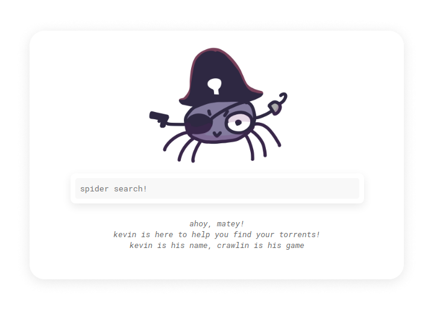

<p align="center">
	<br>
	<strong>SpiderPirate</strong>
</p>

#### What is this?

SpiderPirate is a tiny program that scrapes popular tracker torrent
sites, and then outputs it out to you, either via it's very simple HTTP
API, or through the frontend.

#### How do I install it?

SpiderPirate is written in Node.js, and with only two dependencies.
Simply clone the repository, install the dependencies and run the
`index.js` file.

Here's how that might look:

```sh
$ git clone https://github.com/KiruPoruno/spiderpirate

$ cd spiderpirate

$ npm i

$ node src/index.js
```

SpiderPirate runs on port `15471`, and automatically serves the `www`
folder, meaning it is independent of any other web server, however
putting it behind a load balancer or proxy may be useful.

After SpiderPirate is installed, you'll want to setup the settings file,
do this by either overwriting `base_settings.json` directly, or making a
new file called `settings.json` in the root of the Git repo. And then
you'll want to fill out the file. An example of the settings file:

```json
{
	"proxies": {
		"tpb": "<your preferred proxy>",
		"leetx": "<your preferred proxy>",
		"therarbg": "<your preferred proxy>"
	}
}
```

Setting any of the proxy settings to `false` will disable that source.

#### HTTP API

The API has 3 endpoints, and they're all very simple to use and parse.

##### GET `/search/:query`

This returns the list of torrents from all the available sources.

##### GET `/search/:source/:query`

This returns the list of torrents but only from a specific source if
supported.

##### GET `/sources`

This returns back an array of all the sources the backend has setup and
supports.



#### Who's the handsome fella/mascot?

That would be kevin, he's very handsome and he says thanks for the
compliments,  he was drawn by [Ode N.](https://ode-n.carrd.co)

He's the one who crawls on the interwebs and retrieves all the
information for you! Thank him when you got the free time!
